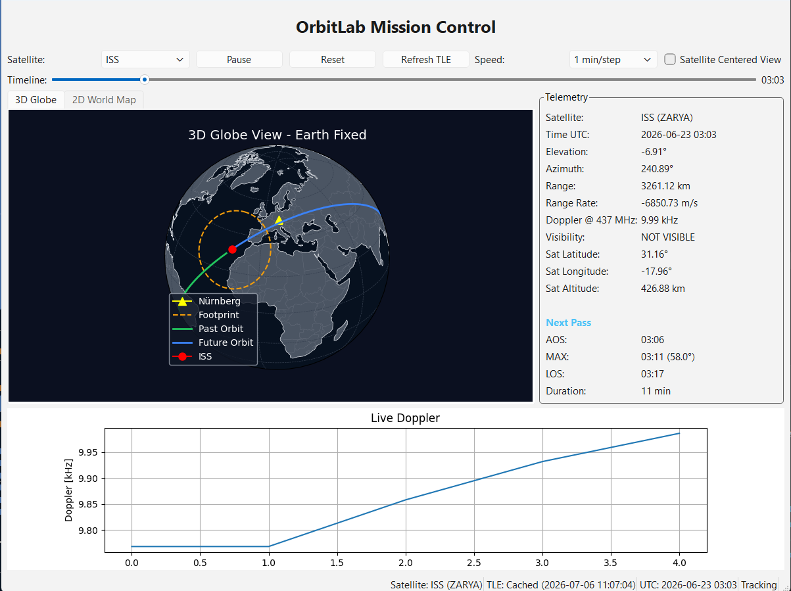

# 🛰 OrbitLab

<p align="center">

**A Professional Satellite Tracking & Mission Analysis Platform**

Real-Time Orbit Tracking • Doppler Analysis • Ground Station Visibility • Pass Prediction • Mission Visualization

</p>

---

## Overview

OrbitLab is a modular satellite tracking and mission analysis software developed in Python.

The project combines modern orbital mechanics, real-time satellite tracking, Doppler estimation, mission visualization, and interactive mission planning inside a desktop application.

The software has been designed with aerospace software engineering principles in mind and serves as a foundation for future developments such as SDR integration, orbit determination, FPGA hardware acceleration, and mission replay.

---

## Main Features

### Satellite Tracking

- Real-time satellite tracking using TLE data
- Support for multiple satellite catalogs
- Automatic TLE download
- Local TLE cache
- Manual TLE refresh
- Satellite manager

---

### Mission Analysis

- Pass Prediction

  - Acquisition Of Signal (AOS)
  - Maximum Elevation (MAX)
  - Loss Of Signal (LOS)
  - Pass duration

- Visibility analysis

- Ground station geometry

- Doppler shift calculation

- Range calculation

- Azimuth & Elevation calculation

---

### Visualization

- 🌍 Interactive 3D Globe

- 🗺 2D Ground Track View

- Past orbit

- Future orbit

- Ground station marker

- Satellite marker

- AOS marker

- MAX marker

- LOS marker

- Day / Night Terminator

---

### Simulation

- Mission timeline

- Time navigation

- Play

- Pause

- Reset

- Variable simulation speed

---

### User Interface

- PyQt6 desktop application

- Mission Control interface

- Status Bar

- Telemetry panel

- Doppler plot

- Satellite selector

---

## Screenshot

> Add your latest screenshot here.

```

```

Example:

```markdown

```

---

# Software Architecture

```
OrbitLab
│
├── GUI
│   ├── Mission Control
│   ├── 3D Globe
│   ├── 2D World Map
│   ├── Telemetry
│   ├── Doppler Plot
│   └── Status Bar
│
├── Orbit
│   ├── Satellite
│   ├── Tracker
│   ├── Clock
│   ├── Pass Predictor
│   ├── TLE Manager
│   └── Satellite Catalog
│
├── Geometry
│   ├── Doppler
│   ├── Calculator
│   └── Visibility
│
├── Cache
│
└── Assets
```

---

# Project Structure

```
OrbitLab
│
├── cache/
│   └── tle/
│
├── geometry/
│   ├── calculator.py
│   ├── doppler.py
│   └── visibility.py
│
├── gui/
│   ├── doppler_plot.py
│   ├── earth_view.py
│   ├── world_map_view.py
│   ├── main_window.py
│   └── status_bar.py
│
├── orbit/
│   ├── clock.py
│   ├── pass_predictor.py
│   ├── satellite.py
│   ├── satellite_catalog.py
│   ├── tle_manager.py
│   └── tracker.py
│
├── screenshots/
│
├── assets/
│
├── main.py
├── README.md
└── requirements.txt
```

---

# Technologies

- Python 3.12+

- PyQt6

- Skyfield

- Cartopy

- Matplotlib

- NumPy

---

# Installation

Clone the repository

```bash
git clone https://github.com/your_username/OrbitLab.git

cd OrbitLab
```

Install dependencies

```bash
pip install -r requirements.txt
```

Run

```bash
python main.py
```

---

# Current Capabilities

✅ Real-Time Satellite Tracking

✅ Doppler Shift Calculation

✅ Ground Track Visualization

✅ Pass Prediction

✅ TLE Cache Manager

✅ Day/Night Terminator

✅ Timeline Navigation

✅ Mission Playback

✅ Status Monitoring

---

# Roadmap

## Version 1.1

- Multiple satellites

- Multiple ground stations

- Satellite footprints

- Satellite search

---

## Version 1.2

- Mission recorder

- Mission replay

- Orbit history

- Telemetry export

---

## Version 2.0

- Orbit determination

- SDR integration

- Automatic Doppler correction

- Coverage analysis

- Constellation visualization

- FPGA backend

---

# Future Vision

OrbitLab is intended to evolve into a complete mission analysis platform capable of supporting

- satellite operations

- amateur radio satellite tracking

- educational missions

- SDR applications

- CubeSat projects

- FPGA-based mission systems

- aerospace research

---

# Author

## Rasool Daneshmandi

Embedded Systems Engineer

M.Sc. Embedded Systems Engineering

University of Duisburg-Essen

Specialized in

- FPGA Design

- Embedded Systems

- Satellite Tracking

- Signal Processing

- Real-Time Systems

- Hardware Development

---

# License

MIT License

---

# Acknowledgment

This project uses several outstanding open-source libraries, including

- Skyfield

- Cartopy

- Matplotlib

- PyQt6

whose developers made this work possible.